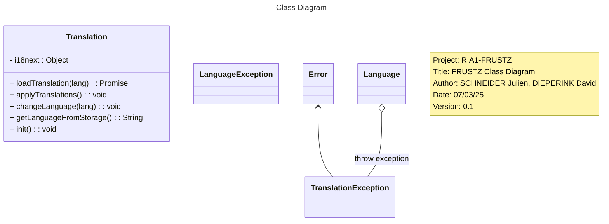

# Diagramme de class

```mermaid
---
title: Class Diagram
---
classDiagram
    note "Project: RIA1-FRUSTZ
    Title: FRUSTZ Class Diagram
    Author: SCHNEIDER Julien, DIEPERINK David
    Date: 07/03/25
    Version: 0.1"

    class Translation {
        
        - i18next : Object
        
        + loadTranslation(lang) : Promise<Object> 
        + applyTranslations() : void    
        + changeLanguage(lang) : void                    
        + getLanguageFromStorage() : String              
        + init() : void
    }

    class LanguageException { }

    class Error{ }

    Error <-- TranslationException

    Language o-- TranslationException : throw exception
```
